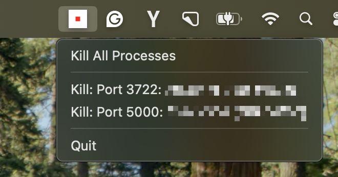

# 🚧 Port Kill

A lightweight macOS status bar app that monitors and manages development processes running on ports 2000-6000. The app provides real-time process detection and allows you to kill individual processes or all processes at once.



## Features

- **Real-time Monitoring**: Scans ports 2000-6000 every 5 seconds using `lsof` commands
- **Visual Status Bar Icon**: Shows process count with color-coded center (green=0, red=1-9, orange=10+)
- **Dynamic Context Menu**: Updates every 3 seconds with current processes and kill options
- **One-Click Process Killing**: Click any menu item to kill all detected processes
- **Safe Process Termination**: Uses SIGTERM → SIGKILL termination strategy
- **Stable Architecture**: Built with winit event loop for macOS compatibility
- **Graceful Error Handling**: Handles permission errors and process failures
- **No Windows**: Pure status bar application with no main window

## Status Bar Icon

The status bar icon provides instant visual feedback:

- **Green**: 0 processes (safe, no development servers)
- **Red**: 1-9 processes (some development servers)
- **Orange**: 10+ processes (many development servers)

Hover over the icon to see the exact process count in the tooltip.

## Menu Options

- **Kill All Processes**: Terminates all detected development processes
- **Individual Process Entries**: Format: "Kill: Port 3001: node (PID 1234)"
- **Quit**: Exits the application

**Note**: Currently, clicking any menu item will kill all processes (for testing purposes).

## Requirements

- macOS 10.15 or later
- Rust 1.70 or later
- `lsof` command (included with macOS)

## Installation

1. Clone the repository:
```bash
git clone <repository-url>
cd port-kill
```

2. Build the application:
```bash
cargo build --release
```

3. Run the application (easy way):
```bash
./run.sh
```

4. Run manually (alternative):
```bash
cargo run --release
```

## Usage

### Basic Usage
1. **Start the Application**: Run `./run.sh` to start the application with default settings (ports 2000-6000)
2. **Monitor Status**: Check the status bar for the process count indicator
3. **Access Menu**: Click on the status bar icon to open the context menu
4. **Kill Processes**: 
   - Click "Kill All Processes" to terminate all development processes
   - Click individual process entries to kill specific processes
5. **Quit**: Click "Quit" to exit the application

### Configurable Port Monitoring

The application now supports configurable port ranges and specific port monitoring:

#### Port Range Examples
```bash
# Monitor ports 3000-8080
./run.sh --start-port 3000 --end-port 8080

# Monitor ports 8000-9000
./run.sh -s 8000 -e 9000
```

#### Specific Ports Examples
```bash
# Monitor only specific ports (common dev ports)
./run.sh --ports 3000,8000,8080,5000

# Monitor React, Node.js, and Python dev servers
./run.sh -p 3000,3001,8000,8080
```

#### Console Mode
```bash
# Run in console mode for debugging
./run.sh --console --ports 3000,8000,8080

# Console mode with verbose logging
./run.sh -c -p 3000,8000,8080 -v
```

#### All Command-Line Options
- `--start-port, -s`: Starting port for range scanning (default: 2000)
- `--end-port, -e`: Ending port for range scanning (default: 6000)
- `--ports, -p`: Specific ports to monitor (comma-separated, overrides start/end range)
- `--console, -c`: Run in console mode instead of status bar mode
- `--verbose, -v`: Enable verbose logging
- `--help, -h`: Show help information
- `--version, -V`: Show version information


## Technical Details

### Architecture

- **Main Thread**: Handles UI events and menu interactions with winit event loop
- **Process Monitor**: Scans for processes every 5 seconds using `lsof`
- **Menu Updates**: Updates context menu every 3 seconds when processes change
- **Process Killing**: Runs in background threads to maintain UI responsiveness

### Process Detection

The application uses the following command to detect processes:
```bash
lsof -ti :PORT -sTCP:LISTEN
```

### Process Termination

1. **SIGTERM**: First attempts graceful termination
2. **SIGKILL**: If process doesn't terminate within 500ms, forces termination

### Port Range

Monitors ports 2000-6000 (broad range covering common development server ports)

## Dependencies

- `tray-icon`: macOS status bar integration
- `winit`: Event loop management
- `nix`: Signal handling for process termination
- `crossbeam-channel`: Thread communication
- `tokio`: Async runtime
- `anyhow`: Error handling
- `serde`: Data serialization

## Development

### Building for Development

```bash
cargo build
```

### Running with Logging

```bash
RUST_LOG=info cargo run
```

## Troubleshooting

### Permission Issues

If you encounter permission errors when trying to kill processes:

1. Ensure the application has the necessary permissions
2. Some system processes may be protected
3. Check if the process is owned by another user

### Process Not Detected

If a process is not being detected:

1. Verify the process is listening on a port in the 2000-6000 range
2. Check if the process is using TCP (not UDP)
3. Ensure the process is in LISTEN state

### Application Not Starting

If the application fails to start:

1. Check if another instance is already running
2. Verify all dependencies are installed
3. Check system logs for error messages

## License

This project is licensed under the FSL-1.1-MIT License. See the LICENSE file for details.

## Contributing

1. Fork the repository
2. Create a feature branch
3. Make your changes
4. Add tests if applicable
5. Submit a pull request
